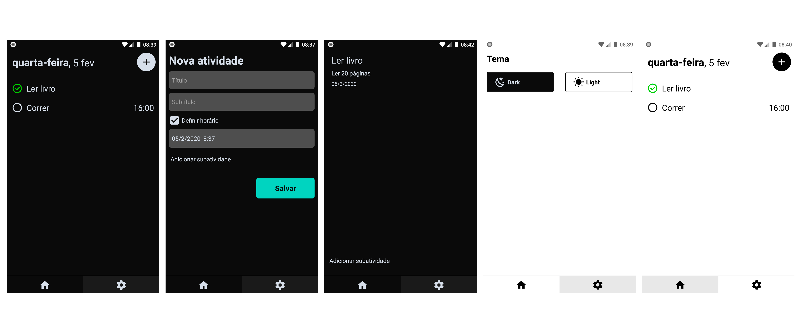

# Todo app

Um aplicativo básico para lista de atividades usando React Native e o banco de dados Vasern. 🔥

## Principais características

- Suporte ao tema escuro
- Acrescentar subatividades
- Opção para definir horário da atividade

## Estrutura do projeto

Este é um aplicativo móvel React Native destinado a Android e iOS.

O código Javascript está na pasta `src` e os aplicativos nativos diferentes estão na `android` e `ios`.

No momento está funcionando apenas no Android.

## Setup

Depois de clonar este repositório, execute:

- `yarn` ou `npm i` para instalar dependências.
- `yarn android` ou `yarn ios` com base no sistema em que quiser trabalhar.
